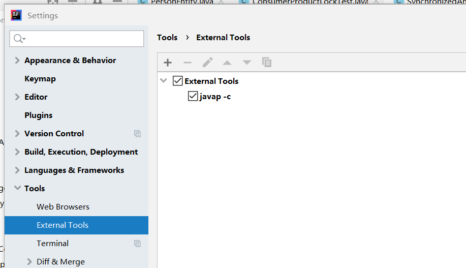
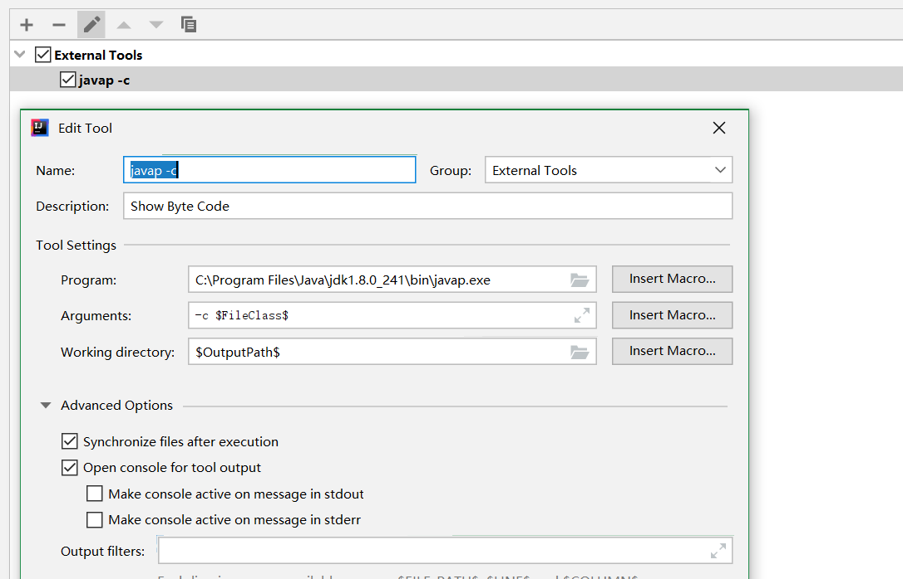
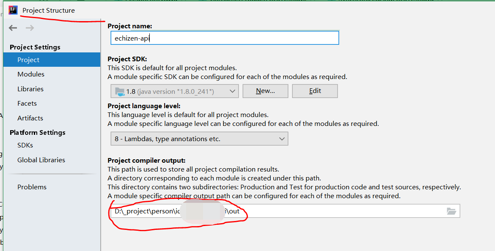
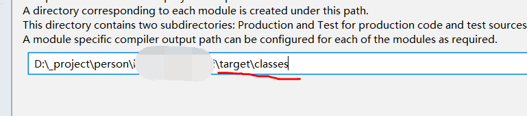
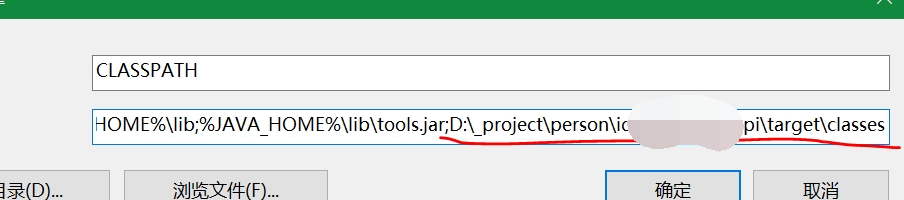

## idea工具扩展javap工具执行报类不存在错误

我本着想添加javap -c工具来查看下代码的字节码，步骤如下：
1. 打开settings: 



2. 在tools里面配置javap工具，参数如下：



3. 配置完后在相应的类中右键->extend tools执行命令，结果发现会报找不到类
```cmd
找不到类错误："C:\Program Files\Java\jdk1.8.0_241\bin\javap.exe" -c com.ryoma.test.JavapTest
```

然后我查看了下自己JavapTest类里对应的文件夹位置，看到确实没有JavapTest.class文件，而javap -c执行的是class文件，
所有我就查看了下class文件输出位置如下：



然后我再看看我工程编译的类文件，是在工程的target/classes文件夹下（target都是和src同级目录的）
我就把输出配置改了下：



同时修改电脑的环境变量CLASSPATH如下：



这样执行就ok不报错了，为什么要修改环境变量呢，因为命令都是在CLASSPATH目录下查找文件的。
记录下，以免大家有遇到跟我一样的，一起踩坑。

