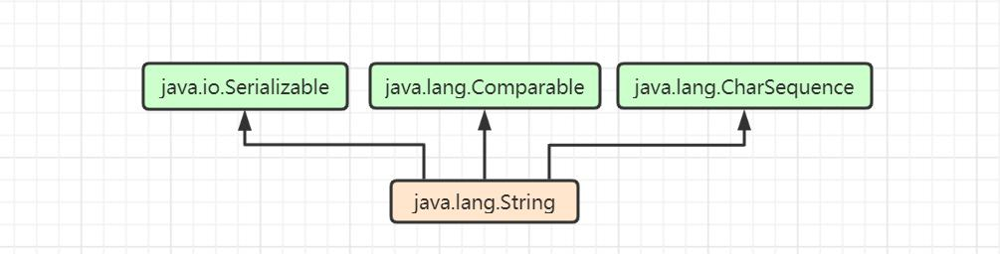

## String类源码分析<java.lang.String>

string类是java里的字符串类型，用于保存形如 "abc" 的内容值，值是不可变的，所以可以被共享。

### 1. 我们先看一下类的定义声明 
``` java
public final class String implements Serializable, Comparable<String>, CharSequence
```


该类是个final类型，说明不能够被继承，自身继承于Object类，实现了三个接口。那这3个接口起到了什么样的作用呢？
* Serializable: 可序列化接口，一个用于标识类是可序列化和反序列化的接口，也就说明String类是可序列化的。
* Comparable<String>：比较排序接口，实现该接口可以实现类的自然排序。
* CharSequence: 定义了可读序列的char值 


