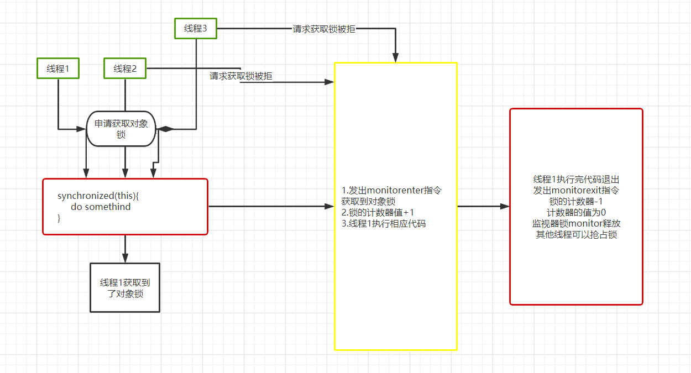
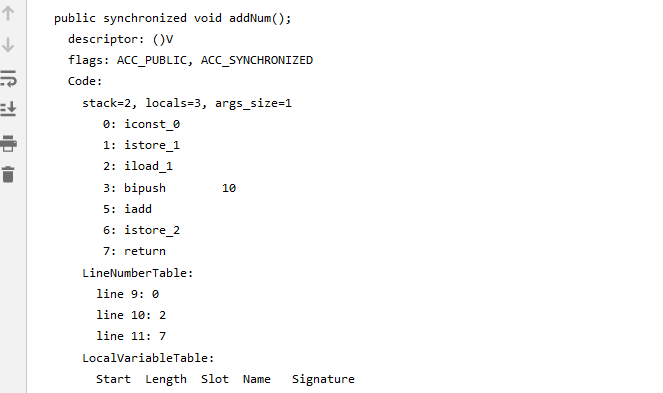
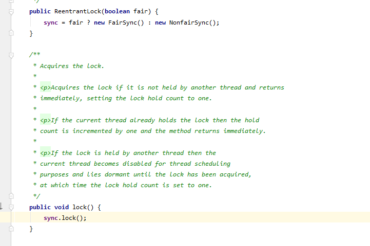
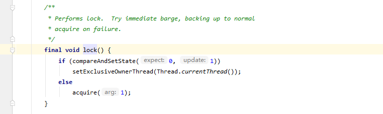
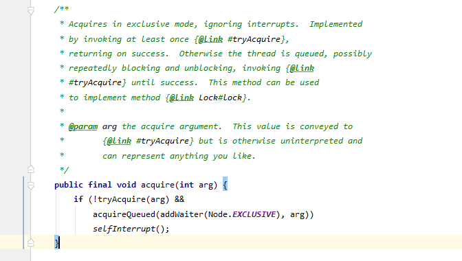
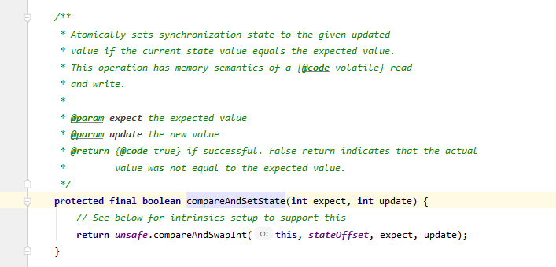
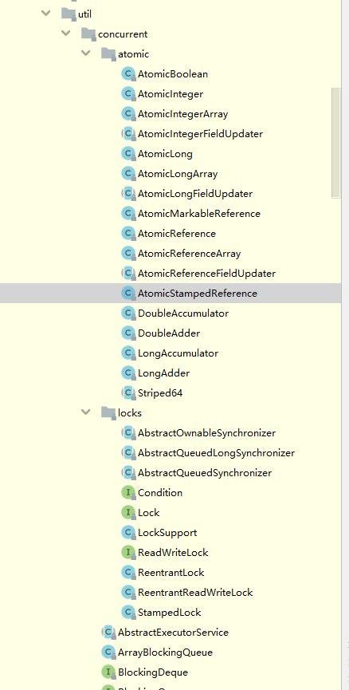
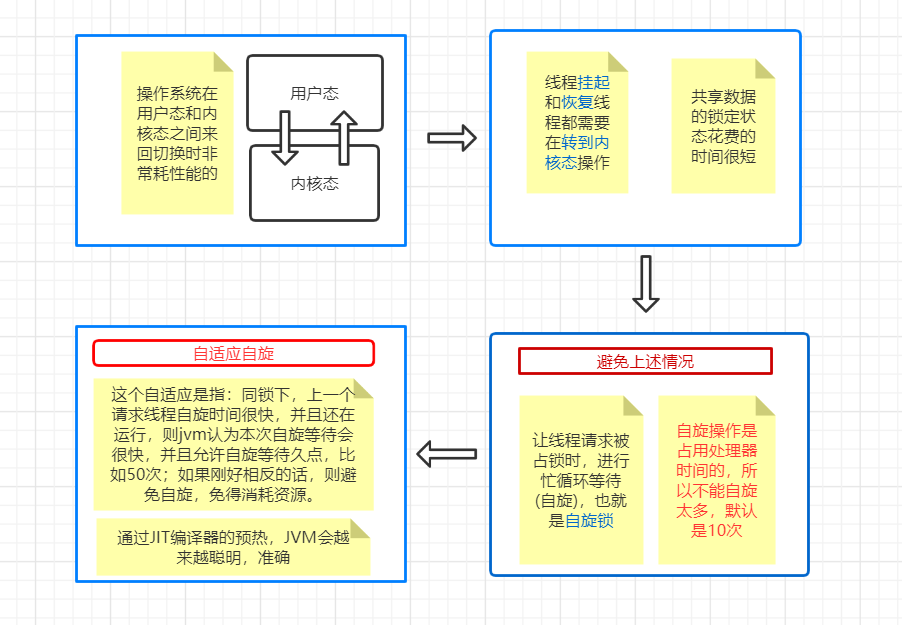
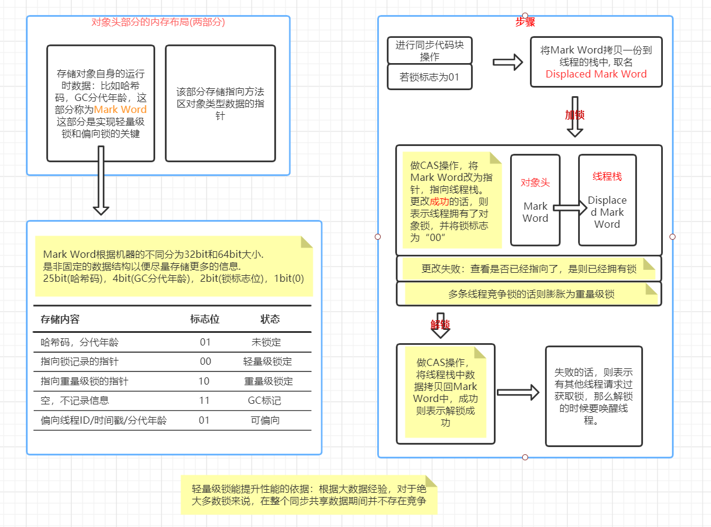

## 谈谈synchronized和Lock

今天想来聊聊同步线程的问题，这是个老生常谈的话题，而且这个也是我面试经常遇到的高频问题，我觉得是时候跟两位老兄聊聊人生了。
首先来单独找它们聊聊，再做个总结看看两者的区别。

### 先和synchronized老一哥促膝长谈

小草：synchronized哥，作为java王朝的元老级人物，您一直致力于‘线程安全’这块领域，且躬身于底层操作系统中工作，还提出了三个有效线程同步的治理方针。
	众所周知您有以下三政策：
	
```java
// 1. 同步代码块（对象锁）
public void test(){
	synchronized(this){...}
}
```
	
```java
// 2. 同步方法块（对象锁）
public synchronized void test(){...}
```
	
```java
// 3. 同步类方法（类锁，类是由ClassLoader类加载器实例化的对象，所以也是Class对象锁）
public static synchronized void test(){...}
```

这三个方针的特点大家也是深有体会的：
1. 对象锁对象的锁，顾名思义是针对对象的，如果有两个对象，那就没法做线程同步了，同样的类锁那就是针对类成员的，类锁其实就是Class的实例对象锁，
	所以说对象锁和类锁是不同的概念，并不会有冲突。
2. 我们可以同步代码块，也可以同步方法，同步的代码量越小，则需要消耗的性能资源就越少，所以应该尽量同步代码块。

小草：synchronized哥，不知我有没有说错？

synchronized哥：没有，你说的都在点。

小草：这些方针我们都是知道的，但是呢，不知道大家有没有跟我一样有个困惑，我感觉自己看到的都是表层，这些政策下是怎么有序不紊的运作的我并不知道。

synchronized哥：你有这困惑是正常的，因为我们只是交给大家工具去运作，并不需要大家明白这制造步骤，既然你好奇，那我跟你一步步的讲讲吧：
- 我们先来讲讲同步代码块，开始讲述之前呢我得做一下以下的准备：

一个synchronized修饰的方法：
```java
public void addNum(){
	synchronized (this){
		int i = 0;
		int y = i + 10;
	}
}
```

javap -c 命令查看编译的字节码：
```java

public void addNum();
    Code:
       0: aload_0
       1: dup
       2: astore_1
       3: monitorenter
       4: iconst_0
       5: istore_2
       6: iload_2
       7: bipush        10
       9: iadd
      10: istore_3
      11: aload_1
      12: monitorexit
      13: goto          23
      16: astore        4
      18: aload_1
      19: monitorexit
      20: aload         4
      22: athrow
      23: return
```
准备完毕，我们可以看到字节码是一些操作指令，可以注意到3指令是monitorenter，这是操作系统层的监视器monitor指令，当线程要进入这块代码时，需要
尝试去获取对象锁，如果对象锁未被占有，即监视器锁monitor的值为0，则可以获取对象锁，获取到锁之后monitor的计数器+1，并且排斥其他线程获取
监视器锁monitor,就是一种互斥的标识，跟true/false差不多的意思。在占有期间别的线程不能进来；对于对象锁的获取synchronized是可重入的。而且我们
可以看到12指令是monitorexit，就是通知其他的线程我已经用完了，你们爱咋咋地，即monitor的计数器值变回了0，代码块的synchronized同步就是通过
这对monitor指令实现的。



ps：可重入：假设a线程获取了synchronized(this){...}代码块的this对象锁，而代码块里调用了其他的被synchronized修饰的方法如void b()方法，则
a线程仍然可以通过b()方法第二次获取this对象锁，计数器再+1，这就是可重入，这样可以避免了死锁的发生。

小草：我理解了，我有观察到19指令也是monitorexit，为啥会有多出来的一个指令呢？

synchronized哥: emm，观察的很到位啊，确实是有两个monitorexit，至于原因，其实我们看指令也能猜出来，在12指令退出去之后执行13指令goto 23，也就是
		执行23指令return，这样就结束了，然后我们再看看19,20,22指令，也就能够猜出这是个异常指令，也是在我们代码发生异常的时候，我们会执行第二个
		monitorexit指令，正常情况下是不会执行的。

小草：嗷呜呜~

syn哥：你这是啥子操作！！！

小草：不好意思，职业病发作了

syn哥：......!!!

syn哥: 
- 那我们再来讲讲同步方法的：老样子上代码
```jav
public synchronized void addNum(){
	int i = 0;
	int y = i + 10;
}
```
这次查看字节码指令的命令是javap -c -v，使用javap -c 是看不到有用信息的，可以看到字节码如下：



从图片中我们可以看到方法下面有个ACC_SYNCHRONIZED标识，这就是synchronized我控制方法的策略，其实啊我控制方法的方式和同步代码块的方式
是一样的，我只是把监视器锁monitor的指令掩藏了而已，底层思想都是万变不离其宗的。这块底层运行机制我就算讲完了，你还有什么疑问吗？

小草：syn哥，不是还有个同步静态方法没讲吗？？

syn哥：>o<, 其实你自己思考下都能得出结论的，静不静态都好，都是获取对象锁的，只是要获取的对象不一样，一个是当前类A的实例对象，一个是
Class类的实例对象，那么他们的编译结果就会大致相同的了，还是那句话，底层思想都是差不多的。

小草：odk，我明白了。对于和您持同一政策的java.util.concurrent.locks.Lock，您是什么看法呢？

syn哥：虽然我和它的政策是相同的，但是我们采取的策略还是有所区别的。不知道你对Lock的了解有多少呢？

小草：额...，我只知道他是java API里的一个接口，也是用来做同步操作的。

syn哥：我帮你把他请过来了，你可以问问他。

### 与Lock谈谈理想人生

小草：Lock哥，您好，我们都知道您是同步领域里的先进青年，对于您是怎么控制同步的方便解答一二吗？

Lock哥：过奖了过奖了0v0，你应该知道我是java API层面的接口，所以我不像synchronized一样自动靠操作系统OS来完成同步的操作，但是监视器的
基本原义是一样的，如果我需要同步代码，则需要调用相应的方法来控制，所有的行为都是使用者来控制的。生产者消费者模式，够经典吧，
我来展示下通过Lock来实现该模式，相信以你的智商应该就能明白Lock是什么个情况了。
```java
/**
 * 使用重入锁ReenTrantLock实现消费者与生产者模式
 */
public class ConsumerProductLockTest {

    //用于存储生产和消费的产品
    private List<Object> appList = new ArrayList<>(5);

    //定义一个锁来控制生产消费
    private static Lock lock = new ReentrantLock();
    private static Condition condition = lock.newCondition();

    /**
     * 用于消费产品
     * 1、用锁解锁
     * 2、消费产品，就是消费线程来操作，临界条件：没有产品的时候不能消费，要等待
     * 3、唤醒生产线程生产产品
     */
    public void consumer(){
        lock.lock();
        try{
            // 当容器里的产品没有时，消费线程等待
            while (appList.size() == 0){
                condition.await();
            }
            appList.remove(0);
            System.out.println("\t" + Thread.currentThread().getName() + "消费了1个产品，现在有" + appList.size() + "个产品");
            condition.signalAll();
        } catch (InterruptedException e) {
            e.printStackTrace();
        } finally {
            lock.unlock();
        }
    }

    /**
     * 用于生产产品
     * 1、用锁解锁
     * 2、生产产品，就是生产线程来操作，临界条件：产品放满了就不能再生产产品了，要等待
     * 3、唤醒消费线程进行消费
     */
    public void product(){
        lock.lock();
        try{
            // 当容器里的产品满时，生产线程等待
            while (appList.size() == 5){
                condition.await();
            }
            appList.add(1);
            System.out.println(Thread.currentThread().getName() + "生产了1个产品，现在有" + appList.size() + "个产品");
            condition.signalAll();
        } catch (InterruptedException e) {
            e.printStackTrace();
        } finally {
            lock.unlock();
        }
    }

    public static void main(String[] args) {
        ConsumerProductLockTest cpt = new ConsumerProductLockTest();

        System.out.println("现在有" + cpt.appList.size() + "个产品");

        new Thread(() -> {
            for (int i = 0; i < 10; i++) {
                cpt.product();
            }
        }, "producter").start();

        new Thread(() -> {
            try {
                // 通过休眠来控制容器装满后的状态
                Thread.sleep(3000);
                for (int i = 0; i < 10; i++) {
                    cpt.consumer();
                }
            } catch (InterruptedException e) {
                e.printStackTrace();
            }
        }, "consumer").start();
    }

}
```
这段代码里可以看到有个ReentrantLock类，翻译名字就知道这是可重入锁类，而且他确确实实就叫这个名字，可重入锁类就是ReentrantLock，
跟synchronized的可重入是不一样的概念。ReentrantLock的定义如下：
```java
public class ReentrantLock implements Lock, java.io.Serializable
```
也可以看到：我们是在try/finally代码块里实现lock()/unlock()操作的，要想唤醒/等待线程则需要调用lock.newCondition()获取Condition接口实例，
然后调用await()/signalAll()方法。这就是操作手册了。

小草：嗯嗯，我们知道怎么操作了，那你内部是怎么运作的呢？

Lock哥：既然你已经知道了怎么使用，那我们来将工具拆开来看看是怎么样的：
上面的代码中我们调用了lock()方法：
```java
lock.lock();// 进去ReentrantLock类的lock()来具体看看代码
```



可以看到里面只有sync.lock();一行代码，那sync是什么呢？最上面那里有个构造函数，默认fair参数是false，即sync = new NonfairSync();也就是
说sync是个非公平锁的实例。而且我们也知道了ReentrantLock可以通过构造函数实现公平锁和非公平锁，默认是非公平锁(非公平锁是指哪个线程抢到
锁就运行，抢不到就一直抢一直等到，跟你买奶茶排队不排队一个道理)。 再进去sync.lock();里面看看：



我们可以看到lock()的源码，NonfairSync类是ReentrantLock类里的一个内部类，包括Sync类也是
```java
static final class NonfairSync extends Sync 
```
```java

final void lock() {
	// 通过判断对象锁的期望值是不是0，如果是的话就是设置为1，并且获取对象锁。不是的话则执行else语句
	if (compareAndSetState(0, 1))
		// 返回true的话的设置当前线程占有对象锁
		setExclusiveOwnerThread(Thread.currentThread());
	else
		// 尝试一次独占锁操作，不行的话就在线程队列里排队
		acquire(1);
}
```
以下是acquire()方法的源码：



我们再来看看compareAndSetState()方法的源码：



也就是说我们是通过Unsafe类来实现控制的，而Unsafe类调用的是本地的方法。
```java
public final native boolean compareAndSwapInt(Object var1, long var2, int var4, int var5);
```
而Unsafe的本地方法就是调用操作系统的原义来实现的。工具的整个内部原件就是这样的了

小草：哦，原来是这么回事，那人们经常所说的CAS是什么？

Lock哥：这是线程同步中的一种实现原理，这也是我和synchronized一大不同点，synchronized是使用互斥量来控制线程共享问题，采用的是悲观锁(最极端的一种想法，
认为每次获取数据都会有线程抢修改数据，所以要加锁)，而CAS则是采用了乐观锁，认为不会有其他线程修改数据，通过比较原来的数据来进行数据修改，看全名很好理解，
compareAndSwap，就是比较与交换，通过一个expect(旧值)值和一个update(新值)值，当内存的值 == expect值 为true时，就将 内存的值 = update值，否则循环操作：
```java
public final int getAndSetInt(Object var1, long var2, int var4) {
	int var5;
	do {
		var5 = this.getIntVolatile(var1, var2);
	} while(!this.compareAndSwapInt(var1, var2, var5, var4));

	return var5;
}
```
看到有个do循环，以compareAndSwapInt为条件，通过这种方式控制的数据共享，避免了使用互斥量造成的用户态和内核态的切换消耗，性能会有大大的提高。JUC包里有很多
原子类应用了CAS原理，当然，这个也会造成ABA问题，可以通过AtomicStampedReference来解决，添加一个时间戳来控制，类似svn的版本号，详细的我就不说，可以自行去
查阅资料。



小草：感谢哥的讲解，又学到了点东西。

### 再与synchronized哥深谈

小草：syn哥，我访问Lock哥后发现，您使用的是重量级锁，那效率是不是跟Lock哥有很大的区别呢？

syn哥：在jdk1.5之前确实是，在jdk1.6之后我加入了很多优化操作，效率也就不再是决定性指标了，而且我是偏向操作系统层的实现，以后也会是偏向这种底层设计理念，
更加倾向于原生思想的改进，所以使用我还是有很大的优势的。

小草：那syn哥您在jdk1.6之后加入什么优化操作呢？

syn哥：优化的措施主要有以下5个：

	* 自适应自旋
	* 锁消除
	* 锁粗化
	* 轻量级锁
	* 偏向锁
先来说说 自适应自旋，如图所述：



=> 锁消除：

是指虚拟机即时编译器在运行时，通过逃逸分析来判断数据不会逃逸出去被其他线程访问到，从而将不存在数据共享竞争的锁消除掉。
可能你会有这样的一个疑问？数据共享是我们攻城狮人为判断的，不需要的我们不会加锁。是这个理，但是呢，锁消除更多的是针对jdk里面的代码，JVM有时会优化些
代码，这也可能会造成一些不必要的锁，我们来看段代码：
```java
public String addStr(String s1, String s2, String s3){
	return s1 + s2 + s3;
}
```
这段代码原本会生成新的字符串对象，但是JVM会将它优化成StringBuffer或StringBuilder的连接操作，如下：
```java
public String addStr(String s1, String s2, String s3){
	StringBuffer sb = new StringBuffer();
	sb.append(s1);
	sb.append(s2);
	sb.append(s3);
	return sb.toString();
}
```
sb.append()方法是个同步方法，所以锁的同步操作是在addStr()方法里面，不会跑到外面，所以这里会做个锁消除操作。

【【注意：实际上上述代码并不会产生，因为jdk1.5之后产生的是StringBuilder对象，我只是讲述这种存在性】】

=> 锁粗化：

我们总是推荐将锁的范围尽量缩小，这样锁等待就会很快，也不会消耗太多资源，但是有时会存在这样的一种情况，对一段共享数据代码重复的加锁解锁，这样消耗的性能
就很严重，这时候我们就会将锁的范围扩大。举个爪子：
```java
public void foreach(){
	int num = 10;
	for(int i = 0; i < 20; i++){
		synchronized(this){
			num *= 1.5;
		}
	}
}
```
在这段代码里就会频繁的加锁解锁了，所以需要做锁粗化。

=> 轻量级锁：

该锁是jdk1.6之后的概念，轻量级是对操作系统的互斥量这种传统锁而言的。它的原意是：在多线程没有竞争锁的情景下，减少使用传统的重量锁来降低系统的性能消耗。



=> 偏向锁：

该锁的原意是：消除数据在无竞争情况下的同步，进一步提高程序的运行性能，我们已经知道<轻量级锁>是无竞争下使用CAS操作去消除同步使用的互斥量，那么偏向锁
就是连CAS操作都去掉。

如果有细心注意到上面的存储内容状态的话，会发现Mark Word有个可偏向的标志，就是通过这个来设置 偏向模式。

所谓的偏，指的是线程已经获得了对象锁，接下来也没有其他线程获取的话，则持有偏向锁的线程不需要再进行同步。

小草：看来JVM是真的做了很多优化啊。

### synchronized与Lock的区别

小草：syn哥，通过了解我已经知道了你们之间的情况，那你能给我总结下你们之间的区别吗？

syn哥：这个可以有，既然你已经都了解了，那我就直接上招了：

1. synchronized是线程同步的关键字，是通过操作系统来处理线程同步问题的。而java.util.concurrent.locks.Lock接口是API上提供的同步锁。
2. Lock添加了一些高级操作：可中断，可设置公平锁，可通过Condition实现多条件顺序执行，而我synchronized则没有。
3. Lock需要主动调用方法lock()和unlock()来加解锁（配合try/finally语句来使用），不然有可能造成死锁。而我synchronized开启的线程在启动后，
进程跑完后会自动释放锁结束。
4. Lock是通过CAS实现的乐观锁，而我synchronized则是使用操作系统互斥量实现的悲观锁。
	


