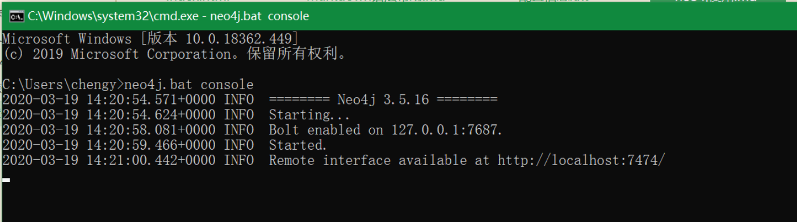
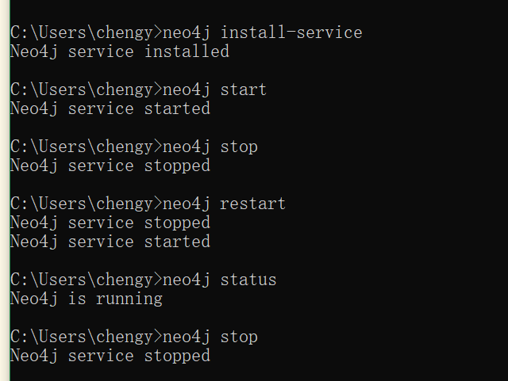
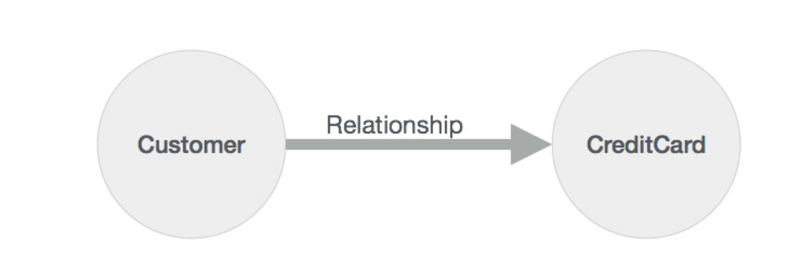
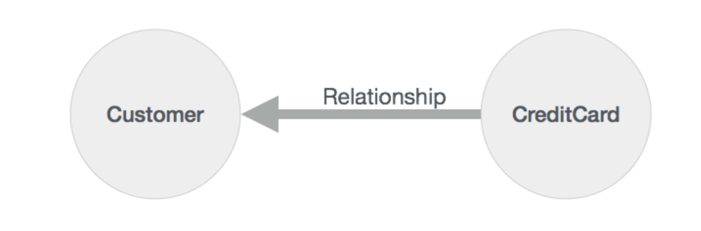
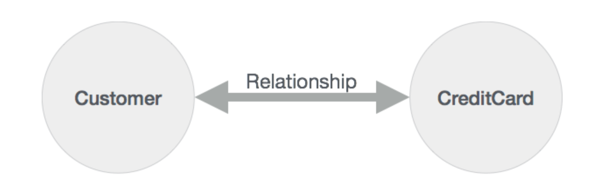
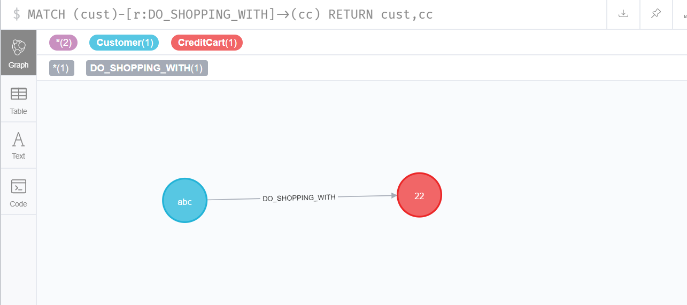

# neo4j图数据库文档

- 图数据库主要是用来存储更多的连接数据。
- 特点：
	* SQL就像简单的查询语言Neo4j CQL
	* 遵循属性图数据模型
	* 使用Apache Lucence支持索引
	* 支持unique约束
	* 包含一个用于执行CQL命令的UI：Neo4j数据浏览器
	* 支持完整的ACID（原子性，一致性，隔离性和持久性）规则
	* 采用原生图形库与本地GPE（图形处理引擎）
	* 支持查询的数据导出到JSON和XLS格式
	* 提供了REST API，可以被任何编程语言（如Java，Spring，Scala等）访问
	* 可以通过任何UI MVC框架（如Node JS）访问的Java脚本
	* 支持两种Java API：Cypher API和Native Java API来开发Java应用程序
- 优势：
	* 很容易表示连接的数据
	* 检索/遍历/导航更多的连接数据是非常容易和快速的
	* 非常容易地表示半结构化数据
	* Neo4j CQL查询语言命令是人性化的可读格式，非常容易学习
	* 简单而强大的数据模型
	* 不需要复杂的连接来检索连接的/相关的数据，因为它很容易检索它的相邻节点或关系细节没有连接或索引
## 数据模型：

## 安装数据库：

1. 路径：(http://www.neo4j.org/download)下载zip文件
2. 配置环境变量：
	* set NEO4J_HOME = <NEO4J_FOLDER_PATH> // 比如我的路径：D:\tools\neo4j\neo4j-community-3.5.16
	* set PATH = %NEO4J_HOME%\bin;％PATH％
	* 检查是否配置正常：打开cmd --> 输入 echo %NEO4J_HOME% , echo %PATH%
3. 验证是否安装成功
	* 控制台中输入：neo4j.bat console
	* 
4. 注册neo4j服务<可选>
	* 控制台中输入：neo4j install-service
5. 开启neo4j服务<可选>
	* 控制台中输入：neo4j start
6. 停止、重启、查询neo4j服务<可选>
	* 停止：neo4j stop
	* 重启：neo4j restart
	* 查询状态：neo4j status
	* 
[启动后的访问路径](http://localhost:7474/browser/)
- 用户和密码默认是neo4j
## Neo4j CQL
### CQL简介

- 它是Neo4j图形数据库的查询语言。
- 一种声明性模式匹配语言
- 遵循SQL语法

- 常用的命令：
	* CREATE<创建>: 创建节点、关系和属性
	* MATCH<匹配>: 检索有关节点、关系和属性的数据
	* RETURE<返回>: 返回查询结果
	* WHERE：提供条件过滤检索数据
	* DELETE: 删除节点和关系
	* REMOVE: 删除节点和关系的属性
	* ORDER BY: 排序检索数据
	* SET<组>: 添加或更新标签
- 常用的函数：
	* String: 用于使用String字面量
	* Aggregation: 用于对CQL查询结果执行一些聚合操作
	* Relationship: 用于获取关系的细节，如startnode，endnode等
- 数据类型：
	* boolean：用于表示布尔文字：true，false
	* byte：表示8位整数
	* short：表示16位整数
	* int：表示32位整数
	* long：表示64位整数
	* float：表示32位浮点数
	* double：表示64位浮点数
	* char：表示16位字符
	* String：表示字符串
### CREATE命令

- 创建没有属性的节点
- 使用属性创建节点
- 在没有属性的节点之间创建关系
- 使用属性创建节点之间的关系
- 为节点或关系创建单个或多个标签

- 创建没有属性的节点：只是创建一个没有任何数据的节点
	* 语法：CREATE (<node-name>: <label-name>)
		+ <node-name>: 创建的节点名称
		+ <label-name>: 是一个节点标签名称
ps：
	* Neo4j数据库服务器使用此<node-name>将此节点详细信息存储在Database.As中作为Neo4j DBA或Developer，我们不能使用它来访问节点详细信息。
	* Neo4j数据库服务器创建一个<label-name>作为内部节点名称的别名。作为Neo4j DBA或Developer，我们应该使用此标签名称来访问节点详细信息。

	eg:
		- 创建一个的“Employee”节点:
			+ CREATE (emp: Employee)
		- 创建一个的“Dept”节点: 
			+ CREATE (dept: Dept)
	
- 创建具有属性的节点：创建一个具有一些属性（键值对）的节点来存储数据。
	* 语法：
		CREATE(
			<node-name>: <label-name>
			{
				<property1-name>:<property1-value>
				...
				<propertyn-name>:<propertyn-value>
			}
		)
	eg:
		create ( dept:Dept { deptno:10, dname: "acount", location: "china"})
		create ( emp: Employee { id:12, name:"lisan", sal:35999, deptno:10})
ps:
	* 要定义字符串类型属性值，我们需要使用单引号或双引号

### MATCH命令

- 从数据库获取有关节点和属性的数据
- 从数据库获取有关节点，关系和属性的数据

- 语法：MATCH(<node-name>:<label-name>)
ps
	* 我们不能单独使用MATCH Command从数据库检索数据。 如果我们单独使用它，那么我们将InvalidSyntax错误
### RETURN子句

- 检索节点的某些属性
- 检索节点的所有属性
- 检索节点和关联关系的某些属性
- 检索节点和关联关系的所有属性

- 语法：
	RETURN
		<node-name>.<property1-name>,
		...,
		<node-name>.<propertyn-name>
ps
	* 我们不能单独使用RETURN子句。我们应该既MATCH使用或CREATE命令
### MATCH & RETURN匹配和返回

- 检索节点的某些属性
- 检索节点的所有属性
- 检索节点和关联关系的某些属性
- 检索节点和关联关系的所有属性

- MATCH RETURN命令语法：
	MATCH command
	RETURN command
	
	eg:
		MATCH (dept:Dept)
		RETURN dept.deptno, dept.dname
	
	eg:
		MATCH (dept:Dept)
		RETURN dept.deptno, dept.dname, dept.location
		
	eg:
		MATCH (dept:Dept)
		RETURN dept
		
### CREATE+MATCH+RETURN命令

	eg: 创建customer客户节点
		create(e:Customer{id:1001, name:'abc', dob:'1/19/2020'})
		
	eg: 创建CreditCard节点
		create(cc:CreditCart{id:5001, number:'123456789', cvv:'888', expiredate:'25/10'})
		
	eg: 查看客户节点详细信息
		match (e:Customer)
		return e.id, e.name, e.dob
		
	eg: 查看CreditCard节点详细信息
		match (cc:CreditCart)
		return cc.id, cc.number, cc.cvv, cc.expiredate
### 关系基础

- Neo4j图数据库遵循属性图模型来存储和管理其数据
- 根据属性图模型，关系应该是定向的。 否则，Neo4j将抛出一个错误消息
- 基于方向性，Neo4j关系被分为两种主要类型
	* 单向关系
	* 双向关系
- 使用Neo4j CQL CREATE命令来创建两个节点之间的关系。 这些情况适用于Uni和双向关系
	* 在两个现有节点之间创建无属性的关系
	* 在两个现有节点之间创建与属性的关系
	* 在两个新节点之间创建无属性的关系
	* 在两个新节点之间创建与属性的关系
	* 在具有WHERE子句的两个退出节点之间创建/不使用属性的关系
	
- 创建客户和CreditCard之间的关系
	
	* 客户 -> 卡
	* 每个关系（→）包含两个节点
		+ 从节点
		+ 到节点
	* 从上图中，Customer节点是“From Node”，CreditCard Node是“To Node”这种关系。
	* 对于节点，它们是两种关系
		+ 外向关系
		+ 传入关系
- 创建从“CreditCard”节点到“客户”节点的关系
	
	* 关系是“出局关系”到“信用卡”节点，并且相同的关系是“到达关系”到“客户”节点。
- 我们在“CreditCard”和“Customer”节点之间创建了两个关系：一个从“CreditCard”到“Customer”。 另一个从“客户”到“信用卡”。 这意味着它是双向关系
	
	
#### 没有属性的关系与现有节点

- 语法：
	match (<node1-label-name:node1-name>),(<node2-label-name:node2-name>)
	create 
		(<node1-label-name>)-[<relationship-label-name>:<relationship-name>]->(<node2-label-name>)
	return <relationship-label-name>
	
	* <node1-name>：用于创建关系的“From Node”的名称
	* <node1-label-name>：用于创建关系的“From Node”的标签名称
	* <node2-name>：用于创建关系的“To Node”的名称
	* <node2-label-name>：用于创建关系的“To Node”的标签名称
	* <relationship-name>：是一个关系的名称
	* <relationship-label-name>：是一个关系的标签名称
ps
	* RETURN子句是可选的。 如果我们想立即看到结果，那么使用它。 否则，我们可以省略这个子句
	eg: 从客户到信用卡关系
		+  验证客户和CreditCard节点可用
			match(e:Customer)
			return e
			
			match(cc:CreditCart)
			return cc
		+ 创建关系
			match (e:Customer),(cc:CreditCart)
			create (e)-[r:DO_SHOPPING_WITH]->(cc)
			
			MATCH (e)-[r:DO_SHOPPING_WITH ]->(cc) 
			RETURN r
		
#### 与现有节点的属性的关系

- 语法：
	MATCH (<node1-label-name>:<node1-name>),(<node2-label-name>:<node2-name>)
	CREATE  
		(<node1-label-name>)-[<relationship-label-name>:<relationship-name>
		{<define-properties-list>}]->(<node2-label-name>)
	RETURN <relationship-label-name>
	
	* <define-properties-list>：是分配给新创建关系的属性（名称 - 值对）的列表
#### 新节点无属性关系

- 语法：
	create (<node1-label-name>:<node1-name>)-[<relationship-label-name>:<relationship-name>]->(<node1-label-name>:<node1-name>)
	return <relationship-label-name>
	eg:
		CREATE (fb1:FaceBookProfile1)-[like:LIKES]->(fb2:FaceBookProfile2) 
	eg:
		match(fb1:FaceBookProfile1)-[like:LIKES]->(fb2:FaceBookProfile2)
		return like
	eg: 可以返回ui图
		match p = (fb1:FaceBookProfile1)-[like:LIKES]->(fb2:FaceBookProfile2)
		return p
#### 新节点与属性的关系

- 语法：
	CREATE  
		(<node1-label-name>:<node1-name>{<define-properties-list>})-
		[<relationship-label-name>:<relationship-name>{<define-properties-list>}]
		->(<node1-label-name>:<node1-name>{<define-properties-list>})
	RETURN <relationship-label-name>
	eg:
		CREATE (video1:YoutubeVideo1{title:"Action Movie1",updated_by:"Abc",uploaded_date:"10/10/2010"})
		-[movie:ACTION_MOVIES{rating:1}]->
		(video2:YoutubeVideo2{title:"Action Movie2",updated_by:"Xyz",uploaded_date:"12/12/2012"}) 
	eg: 查看视图
		MATCH (cust)-[r:DO_SHOPPING_WITH]->(cc) 
		RETURN cust,cc
		
#### 多个标签到节点

- 语法：
	CREATE (<node-name>:<label-name1>:<label-name2>.....:<label-namen>)
	eg:
		create (m::Movie:Cinema:Film:Picture)
		
### WHERE子句

