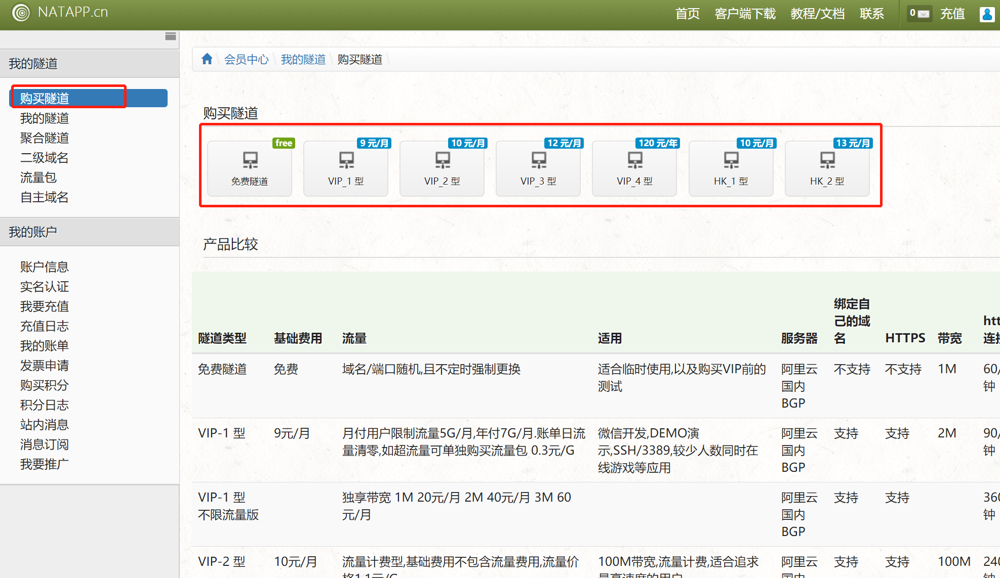

# 使用natapp实现内网穿透

在进行本地开发时，本地的内网地址是无法被外网访问的，为了让外网能够访问到我们内网的接口地址，需要弄个内网穿透。
通俗的来说，就是我们本地开发了个网站，想让其他人访问，但是其他人又访问不了我们本地的地址，所以需要弄个内网穿透去完成这个事。

- 步骤如下：
	* 官方提供的教程文档：[官方的教程文档](https://natapp.cn/article/natapp_newbie)
1. 在natapp官网注册并登录账户，购买或使用免费的隧道
	
2. 填写相关隧道信息，支付，购买
	
3. 下载客户端
	
4. 解压文件，新建或下载config.ini文件
	
	
5. 运行exe文件
	
	Tunnel Status  Online 代表链接成功
	Version      当前客户端版本,如果有新版本,会有提示
	Forwarding    当前穿透 网址 或者端口
	Web Interface  是本地Web管理界面,可在隧道配置打开或关闭,仅用于web开发测试
	Total Connections 总连接数
	Avg Conn Time 0.00ms 这里不代表,不代表,不代表 延时,需要注意!
Forwarding对应的地址就是你的访问地址了
