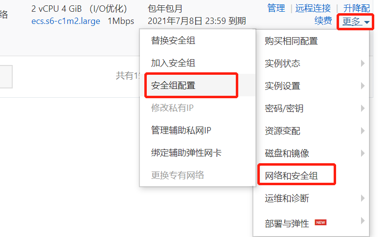

# 配置xshell连接阿里云服务器

1. 登录阿里云服务器，点击实例。
 

2. 设置xshell连接密码：点击更多 -> 密码/密钥 -> 重置密码。
	
	
3. 配置端口的访问权限。
	
	

# nginx安装

1. nginx下载地址：https://nginx.org/download/
2. 安装4个依赖
	yum -y install gcc zlib zlib-devel pcre-devel openssl openssl-devel
3. 切换到相应的目录建nginx目录
	cd /usr/local
	mkdir nginx
	cd nginx
4. 可以线上下载nginx
	wget http://nginx.org/download/nginx-1.18.0.tar.gz
5. 解压，切换到相应目录
	tar -xvf nginx-1.18.0.tar.gz
	cd nginx-1.18.0/
6. 执行配置命令
	./configure --with-http_ssl_module
	make
	make install
7. 配置conf/nginx.conf文件

nginx.conf文件内容：
```
user  nginxs;<!-- nginxs是创建的用户，需要创建：useradd nginxs -s /sbin/nologin -M -->
worker_processes  1;

error_log  /usr/local/nginx/logs/error.log warn;
#error_log  logs/error.log  notice;
#error_log  logs/error.log  info;

pid        /usr/local/nginx/logs/nginx.pid;


events {
    worker_connections  1024;
}


http {
    include       mime.types;
    default_type  application/octet-stream;

    log_format  main  '$remote_addr - $remote_user [$time_local] "$request" '
                      '$status $body_bytes_sent "$http_referer" '
                      '"$http_user_agent" "$http_x_forwarded_for"';

    access_log  /usr/local/nginx/logs/access.log  main;

    sendfile        on;
    #tcp_nopush     on;

    #keepalive_timeout  0;
    keepalive_timeout  65;

    #gzip  on;

    include   nginx.conf.default;   
}
```
nginx.conf.default文件内容：
```
server {
    listen       80;
    server_name  localhost;

    #charset koi8-r;
    #access_log  /var/log/nginx/host.access.log  main;

    location / {
        root   /usr/local/nginx/html;
        index  index.html index.htm;
    }

        location /api {
            rewrite  ^/api/(.*)$ /$1 break;
            proxy_pass http://127.0.0.1:8071;
        }


    #error_page  404              /404.html;

    # redirect server error pages to the static page /50x.html
    #
    error_page   500 502 503 504  /50x.html;
    location = /50x.html {
        root   /usr/local/nginx/html;
    }

    # proxy the PHP scripts to Apache listening on 127.0.0.1:80
    #
    #location ~ \.php$ {
    #    proxy_pass   http://127.0.0.1;
    #}

    # pass the PHP scripts to FastCGI server listening on 127.0.0.1:9000
    #
    #location ~ \.php$ {
    #    root           html;
    #    fastcgi_pass   127.0.0.1:9000;
    #    fastcgi_index  index.php;
    #    fastcgi_param  SCRIPT_FILENAME  /scripts$fastcgi_script_name;
    #    include        fastcgi_params;
    #}

    # deny access to .htaccess files, if Apache's document root
    # concurs with nginx's one
    #
    #location ~ /\.ht {
    #    deny  all;
    #}
}
server {
        listen 443 ssl;   
        server_name localhost;  
        #root html;
        #index index.html index.htm;
        ssl_certificate cert/3952298_sev.jetsoft.mobi.pem; 
        ssl_certificate_key cert/3952298_sev.jetsoft.mobi.key;   
        ssl_session_timeout 5m;
        ssl_ciphers ECDHE-RSA-AES128-GCM-SHA256:ECDHE:ECDH:AES:HIGH:!NULL:!aNULL:!MD5:!ADH:!RC4;  
        ssl_protocols TLSv1 TLSv1.1 TLSv1.2;  
        ssl_prefer_server_ciphers on;
    location / {
        root   /usr/local/nginx/html;
        index  index.html index.htm;
    }

        location /api {
            rewrite  ^/api/(.*)$ /$1 break;
            proxy_pass http://127.0.0.1:8071;
        }
	location = /50x.html {
         root   /usr/local/nginx/html;
        }

}
```

8. 查询是否配置正确：nginx -t
9. 设置全局变量：ln -s /usr/local/nginx/sbin/nginx  /usr/local/bin/
10. 命令：要在nginx.exe当前目录下执行
	启动：/usr/local/nginx/sbin/nginx
	停止：nginx -s stop
	重启：nginx -s reload / service nginx restart
	查看状态：nginx -t
	查看版本号：nginx -v

# mysql安装

1. 下载mysql包：mysql-5.7.30-linux-glibc2.12-x86_64.tar.gz
2. 解压到/usr/local/mysql下：
	tar xzvf mysql-5.7.30-linux-glibc2.12-x86_64.tar.gz
	mv mysql-5.7.30-linux-glibc2.12-x86_64 /usr/local/mysql(/usr/local目录下没有mysql文件夹)
3. 查看用户组是否存在，不存在则创建
	cat /etc/group|grep mysql
	groupadd mysql
	useradd -r -g mysql mysql
4. 创建data文件夹用于存放数据，将所有者改为mysql
	mkdir mysql/data
	chown -R mysql:mysql /usr/local/mysql
	chmod -R 755 /usr/local/mysql

5. 初始化mysql
	./mysqld --initialize --user=mysql --datadir=/usr/local/mysql/data --basedir=/usr/local/mysql
	获取日志中的临时初始密码：p5jnhAUgi_zn
	
6. 修改配置文件/etc/my.cnf
```
[mysqld]
sql_mode=NO_ENGINE_SUBSTITUTION,STRICT_TRANS_TABLES 
 
basedir = /usr/local/mysql
datadir = /usr/local/mysql/data
port = 3306
socket = /tmp/mysql.sock
character-set-server=utf8
symbolic-links=0
max_connections=600
innodb_file_per_table=1
lower_case_table_names=1
log-error = /usr/local/mysql/data/mysqld.log
pid-file = /usr/local/mysql/data/mysqld.pid
```	

7. 创建/usr/local/mysql/data/mysqld.log，/usr/local/mysql/data/mysqld.pid文件并修改.pid文件，启动mysql服务
	touch mysqld.log
	touch mysqld.pid
	vi mysqld.pid  <!-- 随意添加个不存在的pid进程号-->
	./support-files/mysql.server start
	在添加了两个文件后可能没有权限，需要添加权限
	chown -R mysql:mysql /usr/local/mysql
	chmod -R 755 /usr/local/mysql

8. 添加软连接，并重启mysql服务
	ln -s /usr/local/mysql/support-files/mysql.server /etc/init.d/mysql
	ln -s /usr/local/mysql/bin/mysql /usr/bin/mysql
	service mysql restart
	
9. 登录mysql，修改密码(密码为步骤5生成的临时密码)
	mysql -u root -p
	Enter password:
	mysql>set password for root@localhost = password('135246af')
	
10. 开放远程连接
	use mysql;
	update user set user.Host='%' where user.User='root';
	grant all privileges on *.* to root@'%' identified by '123456';
	flush privileges;

11. 开启mysql服务：service mysql start
	停止mysql服务：service mysql stop
	重启mysql服务：service mysql restart

# JDK安装

1. 创建安装目录并下载jdk压缩包：我的盘是/usr/local/src/jdk 
	可以使用 rpm -qa | grep jdk 查看是否有安装过jdk
	wget --no-check-certificate --no-cookies --header "Cookie: oraclelicense=accept-securebackup-cookie" <!-- 该部分参数是为了避免验证-->
	http://download.oracle.com/otn-pub/java/jdk/8u131-b11/d54c1d3a095b4ff2b6607d096fa80163/jdk-8u131-linux-x64.tar.gz
	
2. 解压，重命名
	tar -zxvf jdk-8u131-linux-x64.tar.gz
	mv jdk-8u131-linux-x64.tar.gz jdk1.8

3. 配置环境变量：编辑/etc/profile文件，在最后名添加配置信息
	vi /etc/profile
	shift+g 跑到最后一行
	export JAVA_HOME=/usr/local/src/jdk/jdk1.8
	export PATH=$PATH:$JAVA_HOME/bin
	export CLASSPATH=.:$JAVA_HOME/lib/dt.jar:$JAVA_HOME/lib/tools.jar

4. 让配置文件生效
	source /etc/profile
5. 查看是否成功部署
	java -version


